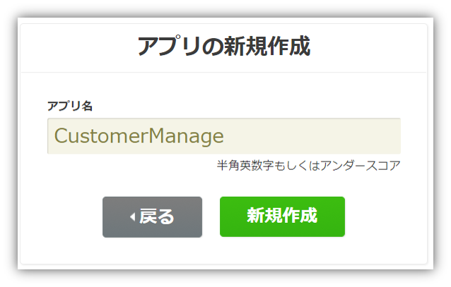

name: inverse
layout: true
class: center, middle, inverse
---
# 【Monaca × ニフティクラウド mobile backend】 クラウドデータベースを使ってみよう！Part.2  『リレーション・権限管理機能を使いこなそう！』
富士通クラウドテクノロジーズ株式会社

.footnote[
20171025作成
]

---
layout: true
class: center, middle, inverse_sub
---
# はじめに

---
layout: false

.footnote_right[
概要
]

## 概要
hoge

.center[]

---
.footnote_right[
概要
]
### 今回体験する内容
#### リレーション・ポインタの活用
* hogehoge

#### ロールによる管理者権限
* hogehoge

.center[]

---
.footnote_right[
概要
]
### Monacaって何？
* __もなか 【[Monaca](https://ja.monaca.io/)】__ HTML5/JavaScript/CSS3でスマホアプリが開発できる開発環境。開発スタイル／コーディング環境は選択可能。

.center[]

---
.footnote_right[
概要
]
### ニフティクラウド mobile backend って何？
* __にふてぃくらうど-もばいる-ばっくえんど 【[ニフティクラウド mobile backend](http://mb.cloud.nifty.com/about.htm)】__ スマートフォンアプリに必要なバックエンド機能が開発不要で利用できるクラウドサービス。 クラウド上に用意された機能をAPIで呼び出すだけで利用できます。また、APIを簡単に使うためのSDKを用意しています（ iOS / Android / Monaca / Unity ）。mobile Backend as a Service の頭文字を取って、通称 **mBaaS** 呼ばれます。

.center[]

---
.footnote_right[
概要
]

### Monaca と mBaaS で サーバー連携アプリは簡単に実現可能に
この２つを組み合わせると、高度なアプリも簡単スピーディーに開発できます

.center[]

.left-column[
__《アプリ側》Monaca のすごいところ__
.size_small_7[
* 無料で使える！
* iOS / Android 同時に開発可能！
* いつでもどこでも、ブラウザで開発OK！
* **mBaaSのSDK導入** がクリックだけで簡単に！
]
]
.right-column[
__《サーバー側》mBaaS のすごいところ__
.size_small_7[
* 無料で使える！
* **バックエンドの開発・運用は一切不要**！
* データの保存はたった **３行** で実装可能！
* **プッシュ通知** も簡単実装！
* **コントロールパネル** からクラウドの状況をパッと確認できる！
]
]

---
layout: true
class: center, middle, inverse_sub
---
# ハンズオン

---
layout: false

## 準備
### 事前準備
下記登録を完了し、アカウントを作成しておいてください。
* [Monaca](https://ja.monaca.io/register/start.html)の利用登録（無料）
* [ニフティクラウド mobile backend (mBaaS)](http://mb.cloud.nifty.com/signup.htm)の利用登録（無料）

### 動作環境準備
* PC
 * Chrome 最新版

---
.footnote_right[
.right[
手順
]
]

## ハンズオン
### 手順
.size_large_15[
1. hoge
1. hoge
1. hoge
1. hoge
1. hoge
]

* hoge

---
## まとめ
* hoge

---
layout: true
class: center, middle, inverse_sub
---
# おわりに

---
layout: false

## おわりに
いかがでしたでしょうか？こんなに使いやすくて便利なmBaaSをもっと活用してみたい方へ、mBaaSの各機能をすぐに試すことができるサンプルアプリを多数ご用意しています。Monacaにサンプルプロジェクトをインポートして、簡単な操作をするだけですぐにお試しいただけます！ぜひご活用ください。

.size_large_11[
* [mobile backend を体験しよう！](https://github.com/NIFTYCloud-mbaas/monaca_data_registration)
 * 使用機能 / データストア
* [アプリにログイン機能をつけよう！](https://github.com/NIFTYCloud-mbaas/monaca_login_template)
 * 使用機能 / 会員管理
* [アプリにプッシュ通知を組み込もう！](https://github.com/NIFTYCloud-mbaas/MonacaPushApp)
 * 使用機能 / プッシュ通知
* [地図アプリを作ろう！](https://github.com/NIFTYCloud-mbaas/MonacaMapApp)
 * 使用機能 / データストア,位置情報検索
* [and more...](http://mb.cloud.nifty.com/doc/current/tutorial/tutorial_monaca.html)
]

---
## 本日の資料配布について
アンケートをご回答いただいた方に資料URLをお送りします。ご協力をお願いします。

---
layout: true
class: center, middle, inverse_sub
---
.center[
## ご清聴ありがとうございました！
]
