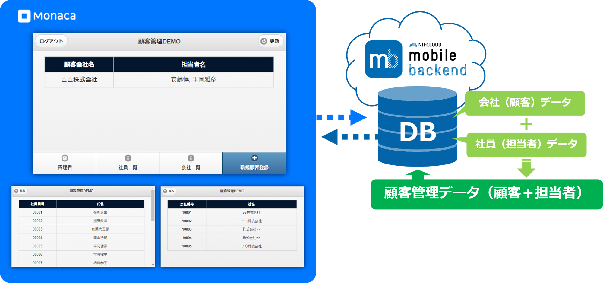
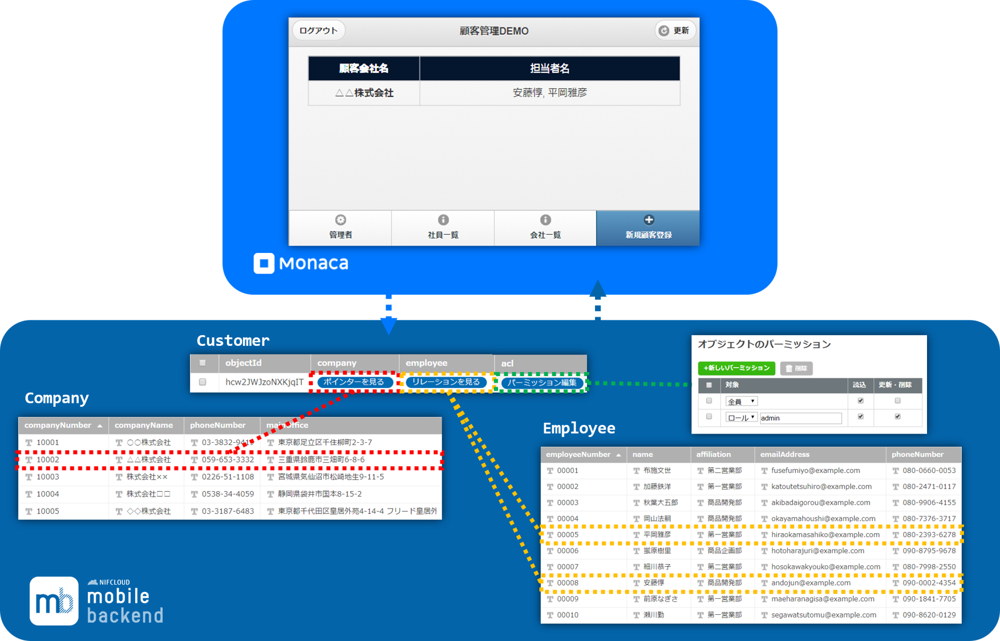
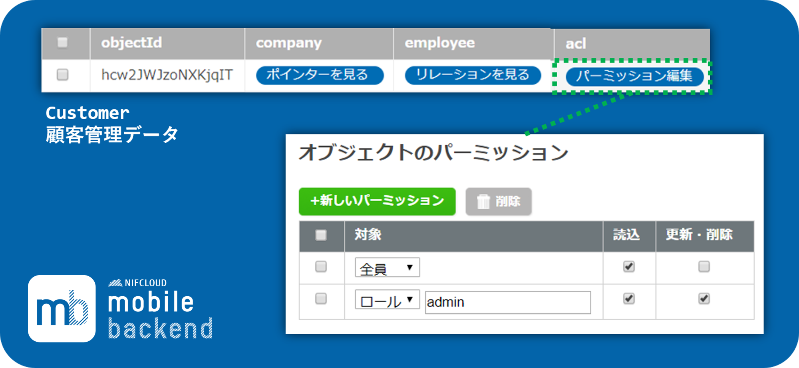
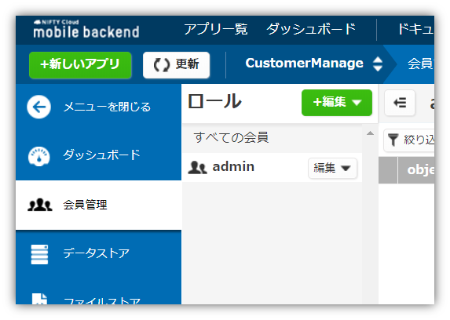

name: inverse
layout: true
class: center, middle, inverse
---
# <span style="font-size: 30%">【Monaca × ニフクラ mobile backend】</span><br> リレーション・権限管理<br>機能を使いこなそう！
富士通クラウドテクノロジーズ株式会社

.right[]
.footnote[
20171025作成（20180627修正）
]

---
layout: true
class: center, middle, inverse_sub
---
# はじめに

---
layout: false

.footnote_right[
はじめに
]

## セミナー概要
__顧客管理アプリ__ をイメージしたサンプルアプリを通して、サーバー連携した業務アプリの作成方法を学びます

.center[]

クラウドデータベースに保持しているデータを活用して顧客管理を行います

---
layout: false

.footnote_right[
はじめに
]

## セミナー概要
クラウドデータベース内のデータを関連付ける「リレーション・ポインタ」機能と権限管理を行う「ACL」機能の活用方法を学び習得します

.center[]

---
.footnote_right[
はじめに
]

## セミナー概要
### データの「関連付け」が出来るメリットとは？
* mobile backend は一般的な RDB（リレーショナルデータベース）とほとんど同様にデータを関連付けて管理することができます
* 関連付けによってデータを管理できるため、同じデータを複数保持する必要がありません
* また同じデータを重複して持たないため、データに更新があった場合も１箇所修正するだけ OK です

.center[]

---
.footnote_right[
はじめに
]

## セミナー概要
### データの「権限管理」が使えるメリットとは？
mobile backendではユーザーをグルーピングするロールという機能があります

* ロールごとに参照権限を設定でき、セキュリティを高められる
* ロール単位で一括して権限を管理できるので、運用効率も上がります

.center[]

---
.footnote_right[
はじめに
]
## 今回利用するツール
### Monaca
* __もなか 【[Monaca](https://ja.monaca.io/)】__ HTML5/JavaScript/CSS3でスマホアプリが開発できる開発環境。開発スタイル／コーディング環境は選択可能。

.center[]

---
.footnote_right[
はじめに
]

## 今回利用するツール
### ニフクラ mobile backend

.left-column[
* __にふくら-もばいる-ばっくえんど 【[ニフクラ mobile backend](http://mb.cloud.nifty.com/about.htm)】__ スマートフォンアプリに必要なバックエンド機能が開発不要で利用できるクラウドサービス。 クラウド上に用意された機能をAPIで呼び出すだけで利用できます。また、APIを簡単に使うためのSDKを用意しています（ iOS / Android / Monaca / Unity ）。mobile Backend as a Service の頭文字を取って、通称 **mBaaS** 呼ばれます。
]

.right-column[
.center[]
]

---
.footnote_right[
はじめに
]

### Monaca と mobile backend で<br>サーバー連携アプリは簡単に実現可能に
この２つを組み合わせると、高度なアプリも簡単スピーディーに開発できます

.center[]

.left-column[
__Monaca のすごいところ__
.size_small_7[
* 無料で使える！
* iOS / Android 同時に開発可能！
* いつでもどこでも、ブラウザで開発OK！
* **mobile backendのSDK導入** がクリックだけで簡単に！
]
]
.right-column[
__mobile backend  のすごいところ__
.size_small_7[
* 無料で使える！
* **バックエンドの開発・運用は一切不要**！
* データの保存はたった **３行** で実装可能！
* **コントロールパネル** からクラウドの状況をパッと確認できる！
]
]

---
.footnote_right[
はじめに
]

## 今回習得できる内容
### リレーション・ポインタの使い方
#### データの関連付け機能「リレーション（１対多）・ポインタ（１対１）」

.size_small_9[
* サンプルアプリを使って、顧客（会社）と社員（担当者）を紐付けした「顧客管理データ」を作成します
  * 保存や取得のコード解説を行います
]
.center[]

---
.footnote_right[
はじめに
]

## 今回習得できる内容
### ロールによる管理ユーザーの作成方法
#### 参照権限機能「会員ロール・ACL設定」

.size_small_9[
* サンプルアプリを使って、「管理ユーザー」の作成方法とその活用方法を学びます
* 「顧客管理データ」読み書き権限設定の方法を紹介します
  * mobile backend  管理画面から手動で設定する方法とコードで設定する方法について解説します
]

.center[]

---
layout: true
class: center, middle, inverse_sub
---
# ハンズオン

---
layout: false

.footnote_right[
ハンズオン
]

### 事前準備
下記登録を完了し、アカウントを作成しておいてください。
* Monaca の利用登録（無料：Freeプランまたはトライアル）
  * https://monaca.mobi/ja/signup
* ニフクラ mobile backend の利用登録（無料：Basicプラン）
  * http://mb.cloud.nifty.com/signup.htm
* ブラウザ Chrome 最新版

### 事前予備知識（知らなくてもOK）
以下機能を利用しますが今回の内容に影響しないため、解説は割愛しています。

* mobile backend データストアの基本（データの保存）は [こちら](http://mb.cloud.nifty.com/doc/current/datastore/basic_usage_monaca.html#オブジェクトの保存) を参照
* 会員管理（ID/PWでの新規登録・ログイン・ログアウト）は [こちら](http://mb.cloud.nifty.com/doc/current/user/basic_usage_monaca.html) を参照

---
.footnote_right[
.right[
ハンズオン
]
]

## 取り組み内容
.size_small_9[
* 今回はコーディング済みサンプルプロジェクトを利用します
* コード実装以外に必要な設定や作業を完了させることで動作できるようになります
]

### 1. 環境と連携の準備
.size_large_11[
1. Monaca の準備
  * サンプルプロジェクトのインポート
1. mobile backend の準備
  * アプリの新規作成
  * データ（会社・社員）のインポート
1. Monaca で mobile backend を利用するための準備
  * mobile backend JS SDK のインポート
  * mobile backend JS SDK の初期化（APIキーの読み込み）
]

---
.footnote_right[
.right[
ハンズオン
]
]

## 取り組み内容
### 2. 動作確認と解説

.size_large_11[
1. インポートしたデータ（会社・社員）の表示確認
  * 新規登録・ログイン処理
  * データの検索取得処理
1. 関連付けしたデータの登録と表示確認
  * 関連付けしたデータの保存・検索取得処理
1. mobile backend 管理画面上で管理ユーザーを作成
1. 各データの参照権限（ACL）設定確認
  * データ保存時のACL設定（jsonインポート）
  * 管理画面でのACL設定
  * データ保存時のACL設定（コード）
1. 管理ユーザーでログイン・ボタンの表示確認
1. データの削除と表示確認
]

---
.footnote_right[
.right[
ハンズオン<br>1.1. Monaca の準備
]
]

### 1.1. Monaca の準備
#### サンプルプロジェクトのインポート

.left-column[
.size_small_9[
* プロジェクトをインポートします
  * 右記リンク先ページを開き「インポート」をクリックします
 * プロジェクトがインポートされたら選択し、「クラウドIDEで開く」をクリックします
]
]
.right-column[
.size_large_15[
<br>
**https://goo.gl/ePeFvB**
]
]
.center[]

---
.footnote_right[
.right[
ハンズオン<br>1.1. Monaca の準備
]
]

* プロジェクトが開かれます
* 次のように画面を設定すると動作確認しやすくなります
  * ① `js/app.js` ファイルを開きます（必須）
  * ② コンソールは使用しないので小さくします（推奨）
  * ③ プレビュー画面を `横向き` に設定します（推奨）

.center[]

これでMonacaの準備は完了です

---
.footnote_right[
.right[
ハンズオン<br>1.2. mobile backend の準備
]
]

### 1.2. mobile backend の準備
#### アプリの新規作成

* mobile backend にログインします

.center[]

http://mb.cloud.nifty.com/

---
.footnote_right[
.right[
ハンズオン<br>1.2. mobile backend の準備
]
]

<br>
* 新しいアプリを作成します
* アプリ名を入力し「`新規作成`」をクリックします　例）.color_blue[__CustomerManage__]

.center[]


* mobile backend を既に使用したことがある場合は、画面上方のメニューバーにある「`+新しいアプリ`」をクリックすると同じ画面が表示されます

.center[]

---
.footnote_right[
.right[
ハンズオン<br>1.2. mobile backend の準備
]
]

<br><br>
* アプリが作成されるとAPIキー（２種類）が発行されます
 * APIキーは後で使用します。
* ここでは使用しないので、「OK」で閉じます

.center[]

---
.footnote_right[
.right[
ハンズオン<br>1.2. mobile backend の準備
]
]

<br>
* 管理画面が表示されます

.center[]

---
.footnote_right[
.right[
ハンズオン<br>1.2. mobile backend の準備
]
]

#### データ（会社・社員）のインポート
* データファイルを以下のURLからダウンロードし、zipファイルを解凍します

.size_large_15[
.center[
<!-- MonacaGyomuApp_Settings.zip -->
**https://goo.gl/Zzs6a3**
]
]

* 「`MonacaGyomuApp_Settings`」フォルダ内、以下のファイルを mobile backend 同様にもう１つもインポートします
  *  `DEMO_Company_5.json`
  *  `DEMO_Employee_10.json`

.center[]

---
.footnote_right[
.right[
ハンズオン<br>1.2. mobile backend の準備
]
]

#### データ（会社・社員）のインポート
* 管理画面で「`データストア`」を開き、`＋作成▼` ＞ `インポート` をクリックします

.center[]

---
.footnote_right[
.right[
ハンズオン<br>1.2. mobile backend の準備
]
]

#### データ（会社・社員）のインポート
* １つずつインポートします
* それぞれ以下のようにクラス名を設定し、ファイルを選択して「 `インポート` 」をクリックします

.center[]

---
.footnote_right[
.right[
ハンズオン<br>1.2. mobile backend の準備
]
]

#### データ（会社・社員）のインポート
* `Company` クラスと `Employee` クラスが作成されました

.center[]

* 図は `Company` クラスが選択され表示されている状態です

<br><br><br>これで mobile backend の準備は完了です。

---
.footnote_right[
.right[
ハンズオン<br>1.3. Monaca で mobile backend を利用するための準備
]
]

### 1.3. Monaca で mobile backend を利用するための準備
#### mobile backend JS SDK のインポート
* Monaca を開き `設定` ＞ `JS/CSSコンポーネントの追加と削除` をクリックます
* 右上の「 `コンポーネント名` 」に「 `ncmb` 」と入力して検索します

.center[]

---
.footnote_right[
.right[
ハンズオン<br>1.3. Monaca で mobile backend を利用するための準備
]
]

#### mobile backend JS SDK のインポート
* 追加をクリックします

.center[]

* バージョンは最新（デフォルト）のまま `インストール` をクリックします

.center[]

---
.footnote_right[
.right[
ハンズオン<br>1.3. Monaca で mobile backend を利用するための準備
]
]

#### mobile backend JS SDK のインポート
* チェックを入れ `保存する` をクリックします

.center[]

* SDK がインポートされました

.center[]

---
.footnote_right[
.right[
ハンズオン<br>1.3. Monaca で mobile backend を利用するための準備
]
]

### 1.3. Monaca で mobile backend を利用するための準備
#### mobile backend JS SDK の初期化（APIキーの読み込み）
* Monaca で `js/app.js` を開き、1～6行目を見てください

.center[]

* 2～3行目の `[NCMB] APIキーの設定` を編集します
  * `YOUR_NCMB_***` の部分をそれぞれ mobile backend でアプリ作成時に発行された２つの APIキー （アプリケーションキーとクライアントキー）に貼り替えます
* APIキー を設定することで、6行目で SDK の初期化が実行され SDK が利用可能になります

---
.footnote_right[
.right[
ハンズオン<br>1.3. Monaca で mobile backend を利用するための準備
]
]

#### mobile backend JS SDK の初期化（APIキーの読み込み）
* mobile backend の APIキー は `アプリ設定` で確認できます

.center[]

---
.footnote_right[
.right[
ハンズオン<br>1.3. Monaca で mobile backend を利用するための準備
]
]

#### mobile backend JS SDK の初期化（APIキーの読み込み）
* こんな感じに設定できていればOK

.center[]

* 最後に必ず保存をしましょう
* 以下のいずれかの方法で保存ができます
  * 「`ファイル`」＞「`保存`」をクリック
  * Windowsの場合は「Ctrl + S」キー、Macの場合は「Command + S」

準備はすべて完了です

---
.footnote_right[
.right[
ハンズオン<br>2.1. インポートしたデータ（会社・社員）の表示確認
]
]

### 2.1. インポートしたデータ（会社・社員）の表示確認
#### 新規登録・ログイン処理
* Monaca のプレビュー画面で動作確認をします
* 後ほど権限管理を行うためログイン機能を実装しています
 * ここでは解説はしません
* `登録` ボタンを押して、新規登録画面からアカウントを作成します

.center[]

---
.footnote_right[
.right[
ハンズオン<br>2.1. インポートしたデータ（会社・社員）の表示確認
]
]

#### 新規登録・ログイン処理

* 今回は動作確認なので、わかりやすいもので ユーザー名 と パスワード を設定しましょう
* 入力したら `登録する` ボタンを押します

.center[]

* 新規アカウントが登録され、同時にログイン処理が実行されます

---
.footnote_right[
.right[
ハンズオン<br>2.1. インポートしたデータ（会社・社員）の表示確認
]
]
#### データの検索取得処理
* ログインに成功すると、トップ画面が表示されます
* まずは「`会社一覧`」をクリックしてみましょう

.center[]

---
.footnote_right[
.right[
ハンズオン<br>2.1. インポートしたデータ（会社・社員）の表示確認
]
]
#### データの検索取得処理
* 会社一覧がリストで表示されるようになっています
* これは「1.2. mobile backend の準備」で mobile backend にインポートした、`Company` クラスのデータを取得してアプリに表示しています

.center[]

---
.footnote_right[
.right[
ハンズオン<br>2.1. インポートしたデータ（会社・社員）の表示確認
]
]
#### データの検索取得処理
* １つ選んでクリックしてみると詳細情報も表示できるようにしています

.center[]

---
.footnote_right[
.right[
ハンズオン<br>2.1. インポートしたデータ（会社・社員）の表示確認
]
]
#### データの検索取得処理
* 「`社員一覧`」も同様に `Employee` クラスのデータを取得して表示しています

.center[]
.center[]

---
.footnote_right[
.right[
ハンズオン<br>2.1. インポートしたデータ（会社・社員）の表示確認
]
]
#### データの検索取得処理
ではどのようなコードでデータの取得が出来ているのでしょうか？<br>コードを確認してみましょう！

.center[]

---
.footnote_right[
.right[
ハンズオン<br>2.1. インポートしたデータ（会社・社員）の表示確認
]
]

#### データの検索取得処理
* `js/app.js` の 65行目 `データ取得(会社)` で会社（`Company`クラス）のデータを取得しています

```js
// [NCMB] Company クラスを生成
var company = ncmb.DataStore('Company');
// [NCMB] Company クラス全件検索/取得
company.order('companyNumber')
       .fetchAll()
       .then(function(results){
           // 検索/取得成功時の処理

       })
       .catch(function(error){
           // 検索/取得失敗時の処理

       });
```

* `order` : 【検索条件】昇順
* `fetchAll` : 全件検索処理
* `then` : 処理成功
* `catch` : 処理失敗

---
.footnote_right[
.right[
ハンズオン<br>2.1. インポートしたデータ（会社・社員）の表示確認
]
]

#### データの検索取得処理
* 同様に、`js/app.js` の 84行目 `データ取得(社員)` で社員（`Employee`クラス）のデータを取得しています

```js
// [NCMB] Employee クラスを生成
var employee = ncmb.DataStore('Employee');
// [NCMB] Employee クラス全件検索/取得
employee.order('employeeNumber')
        .fetchAll()
        .then(function(results){
            // 検索/取得成功時の処理

        })
        .catch(function(error){
            // 検索/取得失敗時の処理

        });
```

---
.footnote_right[
.right[
ハンズオン<br>2.1. インポートしたデータ（会社・社員）の表示確認
]
]

#### データの検索取得処理
* データは次のようなオブジェクトとして取得されます
  * `acl` の内容については後ほど確認します

```json
[
  {
    "objectId":"Pi6s70BOajUT6Qda",
    "createDate":"2017-10-24T01:08:24.238Z",
    "updateDate":"2017-10-24T01:08:24.252Z",
    "acl":{"*":{"read":true},"role:admin":{"read":true,"write":true}},
    "companyNumber":"10001",
    "companyName":"○○株式会社",
    "phoneNumber":"03-3832-9419",
    "mainOffice":"東京都足立区千住柳町2-3-7",
    "remarks":""
  },
  ...
  {
    ...
  }
]
```

* 取得したオブジェクトから値を取って、一覧を構築しています

---
.footnote_right[
.right[
ハンズオン<br>2.2. 関連付けしたデータの登録と表示確認
]
]

### 2.2. 関連付けしたデータの登録と表示確認
#### 関連付けしたデータの保存・検索取得処理
mobile backend に登録したデータを関連付けして、顧客管理をしてみましょう！

* 各顧客（会社）に担当者（社員）をアサインした一覧表を作成します
* トップ画面に戻って右下の新規顧客登録を選択します

.center[]

---
.footnote_right[
.right[
ハンズオン<br>2.2. 関連付けしたデータの登録と表示確認
]
]

#### 関連付けしたデータの保存・検索取得処理
* まずは `顧客選択` のプルダウンをクリックします
* 会社一覧が表示されますので、１社選択します

.center[]

---
.footnote_right[
.right[
ハンズオン<br>2.2. 関連付けしたデータの登録と表示確認
]
]

#### 関連付けしたデータの保存・検索取得処理
* 次に、選択した顧客（会社）の担当者（社員）をアサインします
* `担当社員選択` のプルダウンをクリックします
* 社員一覧が表示されますので、１名選択します

.center[]

---
.footnote_right[
.right[
ハンズオン<br>2.2. 関連付けしたデータの登録と表示確認
]
]

#### 関連付けしたデータの保存・検索取得処理
* 担当者（社員）は５件まで選択可能にしています

.center[]

---
.footnote_right[
.right[
ハンズオン<br>2.2. 関連付けしたデータの登録と表示確認
]
]

#### 関連付けしたデータの保存・検索取得処理
* 最後に `備考` 欄にメモを格納可能です（任意）

.center[]

* `登録する` ボタンを押すと顧客管理データが mobile backend に保存されます

---
.footnote_right[
.right[
ハンズオン<br>2.2. 関連付けしたデータの登録と表示確認
]
]

#### 関連付けしたデータの保存・検索取得処理
.size_small_9[
* トップ画面に遷移します
* 登録した顧客管理データが表示されます
]

.center[]

.size_small_9[
* データはローカルストレージではなく、mobile backend に保存・取得しています
  * `更新` ボタンを押すと mobile backend と同期することができます
* 一覧から項目を選択すると、`備考` に入力した値が アラートで表示されることが確認できます
]

---
.footnote_right[
.right[
ハンズオン<br>2.2. 関連付けしたデータの登録と表示確認
]
]

#### 関連付けしたデータの保存・検索取得処理
どのようにデータが保存されたか、mobile backend を確認してみましょう！

.size_small_9[
* 管理画面からデータストアを確認します
* 新しく `Customer` クラスが作成されたことが確認できます
]
.center[]
.size_small_9[
* 顧客管理データはコピーされて保存されているわけではなく、既存データを関連付けしたデータを作成しています
* `company` フィールドに選択した顧客（会社）が、`employee` フィールドに選択した担当者（社員）がそれぞれ「ポインタ」と「リレーション」として設定されています
]

---
.footnote_right[
.right[
ハンズオン<br>2.2. 関連付けしたデータの登録と表示確認
]
]

#### 関連付けしたデータの保存・検索取得処理
* 「ポインタ」、「リレーション」をクリックするとそれらに関連付けされた `Company` クラスのデータと `Employee` クラスのデータを確認することができます

.center[]

* 「ポインタ」、「リレーション」で関連付けされたデータの保存や取得はどのように実装されているか？コードを確認してみましょう！

---
.footnote_right[
.right[
ハンズオン<br>2.2. 関連付けしたデータの登録と表示確認
]
]

#### 関連付けしたデータの保存・検索取得処理
保存のイメージ

.center[]

---
.footnote_right[
.right[
ハンズオン<br>2.2. 関連付けしたデータの登録と表示確認
]
]

#### 関連付けしたデータの保存・検索取得処理
.size_small_9[
* 保存処理は `js/app.js` の 171行目 `新規顧客登録フォーム「登録する」ボタン押下時の処理` 以下に記載があります
]

**ポインタの作成**
```js
// [NCMB] Company クラスを生成
var Company = ncmb.DataStore('Company');
/*** [NCMB] ポインタデータの作成 ***/
var pointer = new Company({"objectId": companySelectVal});
```

.size_small_9[
* `companySelectVal` は選択した顧客（会社）の `objectId`
]

---
.footnote_right[
.right[
ハンズオン<br>2.2. 関連付けしたデータの登録と表示確認
]
]

#### 関連付けしたデータの保存・検索取得処理

**リレーションの作成**
```js
// [NCMB] Employee クラスを生成
var Employee = ncmb.DataStore('Employee');
/*** [NCMB] リレーションデータの作成 ***/
var relation = new ncmb.Relation();
// [NCMB] リレーションにオブジェクトを設定
relation.add(new Employee({"objectId": employeeSelect_0}));  /* 複数設定可 */
```

.size_small_9[
* `employeeSelect_0` は選択した担当者（社員）の `objectId`
* 複数設定する場合は同様に、 `objectId` 設定し、 `add` することで設定できます
]

---
.footnote_right[
.right[
ハンズオン<br>2.2. 関連付けしたデータの登録と表示確認
]
]

#### 関連付けしたデータの保存・検索取得処理
.size_small_9[
* 作成した「ポインタ」、「リレーション」情報を設定し保存処理をします
  * 一般的な保存処理と同様です
]

**関連付けされたデータの保存**

```js
// [NCMB] Customer クラスを生成
var Customer = ncmb.DataStore('Customer');
// [NCMB] Customer クラスのインスタンスを生成
var customer = new Customer();
// [NCMB] ポインタ/リレーションデータと保存
customer.set('company', pointer) /** ポインタ **/
        .set('employee', relation) /** リレーション **/
        .set('remarks', remarks)
        .save()
        .then(function(result){
            // 新規顧客登録成功時の処理

        })
        .catch(function(error){
            // 新規顧客登録失敗時の処理

        });
```
.size_small_9[
* `set` : 値の設定
* `save` : 保存処理
]

---
.footnote_right[
.right[
ハンズオン<br>2.2. 関連付けしたデータの登録と表示確認
]
]

#### 関連付けしたデータの保存・検索取得処理
取得のイメージ①

.center[]

---
.footnote_right[
.right[
ハンズオン<br>2.2. 関連付けしたデータの登録と表示確認
]
]

#### 関連付けしたデータの保存・検索取得処理
取得のイメージ②

.center[]
---
.footnote_right[
.right[
ハンズオン<br>2.2. 関連付けしたデータの登録と表示確認
]
]

#### 関連付けしたデータの保存・検索取得処理
* 取得処理は `js/app.js` の 103行目 `データ取得（顧客）` 以下に記載があります
* 検索条件を設定することで、ポインタは一括で取得が可能です

```js
// [NCMB] Customer クラスを生成
var customer = ncmb.DataStore('Customer');
// [NCMB] Customer クラス全件検索/取得（ポインタ参照先オブジェクトの情報を含む）
customer.include('company')
        .order('createDate', true)
        .fetchAll()
        .then(function(results){
            // 検索/取得成功時の処理
            // [NCMB] 各データのリレーション先データを全件検索/取得
        })
        .catch(function(error){
            // 検索/取得失敗時の処理

        });
```

* `include('フィールド名')` : <br>【検索条件】指定フィールドに設定されたポインタの参照先データを含む
* `order('フィールド名', true)` : 【検索条件】指定フィールドの降順

---
.footnote_right[
.right[
ハンズオン<br>2.2. 関連付けしたデータの登録と表示確認
]
]

#### 関連付けしたデータの保存・検索取得処理
* リレーションは取得したデータ１件毎に取得する必要があります
  * リレーション参照先データすべてを非同期処理で取得完了させるために、 `Promise` を使用しています
* 処理は `getRelationEmployeeData` で実施しています
  * 次のページで解説します

```js
// [NCMB] 各データのリレーション先データを全件検索/取得
var promises = [];
for (var i = 0; i < results.length; i++) {
    promises.push(getRelationEmployeeData(i)); /* [NCMB] getRelationEmployeeData(int) */
}

/*** Promise ***/
Promise.all(promises)
       .then(function(relationData) {
           // リレーション先データを検索/取得成功時の処理
       });
```

---
.footnote_right[
.right[
ハンズオン<br>2.2. 関連付けしたデータの登録と表示確認
]
]

#### 関連付けしたデータの保存・検索取得処理

```js
// リレーション先のデータを全件検索/取得
function getRelationEmployeeData(int) {
    /*** Promise ***/
    return new Promise(function(resolve, reject) {
        var data = results[int];
        // [NCMB] Employee クラスインスタンス生成
        var employee = ncmb.DataStore('Employee');
        // [NCMB] リレーション先 Employee クラス検索/取得
        employee.relatedTo(data, 'employee')
                .fetchAll()
                .then(function(relationData){
                    // リレーション先データ検索/取得成功時の処理
                    resolve(relationData);
                })
                .catch(function(error){
                    // リレーション先データ検索/取得失敗時の処理
                    reject(error);
                });
    });
}
```

.size_small_9[
* `relatedTo(データ, 'フィールド名')` : <br>【検索条件】指定データの指定フィールドに設定されたリレーションの参照先データを含む

データの関連付けは以上です。<br>次は権限管理の方法を学びましょう！
]
---
.footnote_right[
.right[
ハンズオン<br>2.3. mobile backend 管理画面上で管理ユーザーを作成
]
]

### 2.3. mobile backend 管理画面上で管理ユーザーを作成
管理者グループとして、「管理者ロール」を作成します

* mobile backend 管理画面を開きます
* `会員管理` ＞ `+編集▼` ＞ `ロールの作成` をクリックします

.center[]

---
.footnote_right[
.right[
ハンズオン<br>2.3. mobile backend 管理画面上で管理ユーザーを作成
]
]
<br><br>

* ロール名を `admin` と入力し、`作成する` をクリックします

.center[]

* 管理者ロールとして、`admin` ロールが作成されました

.center[]

---
.footnote_right[
.right[
ハンズオン<br>2.3. mobile backend 管理画面上で管理ユーザーを作成
]
]
<br><br>

* 次に管理者ユーザーを作ります
* `すべての会員` をクリックします
* 先ほどログインに使ったユーザーが表示されるので、その `objectId` をダブルクリックして選択し、コピーを取ります

.center[]

---
.footnote_right[
.right[
ハンズオン<br>2.3. mobile backend 管理画面上で管理者ユーザーを作成
]
]
<br><br>

* 再び `admin` ロールをクリックします
* `+新しい会員▼` ＞ `既存の会員を追加する` をクリックします

.center[]

---
.footnote_right[
.right[
ハンズオン<br>2.3. mobile backend 管理画面上で管理者ユーザーを作成
]
]
<br>

* `会員ID` に先ほどコピーしたユーザーの `objectId` を貼り付けます

.center[]

* `追加する` をクリックすると `admin`ロールにユーザーが追加されたことが確認できます

.center[]

---
.footnote_right[
.right[
ハンズオン<br>2.4. 各データの参照権限（ACL）設定確認
]
]

### 2.4. 各データの参照権限（ACL）設定確認

.size_large_11[

* 管理者としての権限を管理者ロール `admin` に持たせ、`admin` ロールに所属したユーザーを管理ユーザーとします
* 各保存データごとに参照権限（ACL）を「管理ユーザー以外データの書き換えが出来ない状態」に設定します
  * 全員 読み込み許可
  * `admin`ロール 読み書き許可
* `admin` ロールに属しているユーザーは、ロールの持つ権限と同じ権限を持たせることができます
  * 個別ユーザーに権限を設定する場合と比べ、一括で管理が可能なため、権限設定・解除をし易くすることができます！
* 次のページでデータへの権限設定方法を３つご案内していきます
  * データ保存時のACL設定（jsonインポート）
  * 管理画面でのACL設定
  * データ保存時のACL設定（コード）

]

---
.footnote_right[
.right[
ハンズオン<br>2.4. 各データの参照権限（ACL）設定確認
]
]
#### データ保存時のACL設定（jsonインポート）
* json ファイルを使って mobile backend にデータをインポートする際にデータに権限付与が可能です
* ダウンロードしたプロジェクト内 `Setting` ＞ `DEMO_Company_5.json` を開いてみましょう

```json
{"results":[
    {
        "acl":{"*":{"read":true}, "role:admin":{"read":true,"write":true}},
        "companyNumber":"10001",
        "companyName":"○○株式会社",
        "phoneNumber":"03-3832-9419",
        "mainOffice":"東京都足立区千住柳町2-3-7",
        "remarks":""
  	},
    {
      ...
    }
]}
```

* `"*":{"read":true}` : 全員 読み込み許可
* `"role:admin":{"read":true,"write":true}}` : `admin`ロール 読み書き許可

---
.footnote_right[
.right[
ハンズオン<br>2.4. 各データの参照権限（ACL）設定確認
]
]
#### 管理画面でのACL設定
* 管理画面で権限設定を確認してみましょう
* `データストア` ＞ `Company` クラス を選択し、一番右までスクロールします
* `acl` フィールドの `パーミッション編集` をクリックします

.center[]

---
.footnote_right[
.right[
ハンズオン<br>2.4. 各データの参照権限（ACL）設定確認
]
]
#### 管理画面でのACL設定
* 設定されていることが確認できます
* 直接管理画面から権限の編集が可能です

.center[]

---
.footnote_right[
.right[
ハンズオン<br>2.4. 各データの参照権限（ACL）設定確認
]
]
#### データ保存時のACL設定（コード）
* `js/app.js` の 171行目 `新規顧客登録フォーム「登録する」ボタン押下時の処理` 以下に記載があります
* 顧客管理データ保存の際に実は以下のコードを記載しています（先ほどは省略していました）

```js
// [NCMB] 参照権限設定(adminRole:read & write, other: read)
var acl = new ncmb.Acl();
acl.setPublicReadAccess(true)
   .setRoleReadAccess('admin', true)
   .setRoleWriteAccess('admin', true);
// [NCMB] ポインタ/リレーションデータ/ACLの設定と保存
customer.set('company', pointer)
       .set('employee', relation)
       .set('remarks', remarks)
       .set('acl', acl)  /* ←ここで設定★ */
       .save()
```

* `setPublicReadAccess(真偽値)` : 全員 読み込み権限（true: 許可, false: 拒否）
* `setRoleReadAccess('ロール名', 真偽値)` : <br>特定のロール 読み込み権限（true: 許可, false: 拒否）
* `setRoleWriteAccess('ロール名', 真偽値)` : <br>特定のロール 書き込み権限（true: 許可, false: 拒否）

---
.footnote_right[
.right[
ハンズオン<br>2.5. 管理ユーザーでログイン・ボタンの表示確認
]
]

### 2.5. 管理ユーザーでログイン・ボタンの表示確認
* プレビュー画面をリロードするか、１度ログアウトします
  * ログアウトする場合は、トップ画面で左上の `ログアウト` ボタンを押します
* ログイン画面に戻るので、先ほど管理ユーザーに設定したアカウントでログインします

.center[]

---
.footnote_right[
.right[
ハンズオン<br>2.5. 管理ユーザーでログイン・ボタンの表示確認
]
]
<br><br>

* ログインするとトップ画面に先ほどには無かったボタンが現れます！
  * これはログイン処理に成功したタイミングで確認し、アカウントが管理ユーザーであった場合に表示するようにしています

.center[]

* `管理者` ボタンを押してみましょう！

---
.footnote_right[
.right[
ハンズオン<br>2.6. データの削除と表示確認
]
]

### 2.6. データの削除と表示確認
* 管理者ページはトップ画面と同じく顧客管理データの一覧が表示されます

.center[]

* 管理者機能としてデータを削除できるように作っています
* データを１つ選択してみましょう

---
.footnote_right[
.right[
ハンズオン<br>2.6. データの削除と表示確認
]
]
<br><br>

* 確認ダイアログが表示されます
* `はい` を押すと削除が実行されます

.center[]

* 補足
  * 顧客管理データの書き込み権限は管理ユーザーにしか無いため、一般ユーザーではデータの削除することはできません

---
.footnote_right[
.right[
ハンズオン<br>2.6. データの削除と表示確認
]
]
<br><br>

* 削除が完了するとトップ画面に戻ります

.center[]

* 最後に削除処理の実装を確認しましょう！

---
.footnote_right[
.right[
ハンズオン<br>2.6. データの削除と表示確認
]
]
<br>

* 選択した顧客管理データの `objectId` を指定して、該当するデータ削除処理を実行しています
  * 削除は１件ずつおこないます（一括削除を行うことはできません）

```js
// [NCMB] Customer クラスを生成
    var Customer = ncmb.DataStore('Customer');
    // [NCMB] Customer クラスインスタンスを生成
    var customer = new Customer();
    // [NCMB] objectId を指定してデータを削除
    customer.set('objectId', deleteId)
            .delete()
            .then(function(result){
                // 削除成功時の処理

            })
            .catch(function(error){
                // 検索または削除失敗時の処理

            });
```

* `delete()` : 削除

---
.footnote_right[
.right[
ハンズオン
]
]

## まとめ

.size_large_13[

* リレーションとポインタを上手く活用することでデータを楽に管理できることがわかった
  * 同じデータを複数持つ必要がない！
  * データの更新が簡単！
* ロールを使って気軽に管理ユーザーを作れることがわかった
  * データ保存時に簡単に参照権限の設定ができる！
  * 権限を活用すれば、一般ユーザーにデータを改変される心配がなくなる！

]

<br><br><br>
などなど...
mobile backend の活用の幅は広がりましたでしょうか？？
今後のアプリ開発の参考にしていただけたら幸いです\\('▼'\*)/！

---
layout: true
class: center, middle, inverse_sub
---
# おわりに

---
layout: false

.footnote_right[
.right[
おわりに
]
]

## おわりに
使いやすくて便利な mobile backend をもっと活用してみたい方へ、mobile backend の各機能をすぐに試すことができるサンプルアプリを多数ご用意しています。Monaca にサンプルプロジェクトをインポートして、簡単な操作をするだけですぐにお試しいただけます！ぜひご活用ください。

.size_large_11[
* [mobile backend を体験しよう！](https://github.com/NIFCloud-mbaas/monaca_data_registration)
 * 使用機能 / データストア
* [アプリにログイン機能をつけよう！](https://github.com/NIFCloud-mbaas/monaca_login_template)
 * 使用機能 / 会員管理
* [アプリにプッシュ通知を組み込もう！](https://github.com/NIFCloud-mbaas/MonacaPushApp)
 * 使用機能 / プッシュ通知
* [地図アプリを作ろう！](https://github.com/NIFCloud-mbaas/MonacaMapApp)
 * 使用機能 / データストア,位置情報検索
* [and more...](http://mb.cloud.nifty.com/doc/current/tutorial/tutorial_monaca.html)
]

---
layout: true
class: center, middle, inverse_sub
---
.center[
## ご清聴ありがとうございました！
]
