# リレーション・権限管理機能を使いこなそう！
_2017/10/18作成_
## サンプルアプリ概要
データストア「リレーション・ポインタ」と「会員ロール・ACL」を活用したサンプルアプリです。「顧客管理」をイメージして作成しています。

* データの関連付け機能「リレーション（１対多）・ポインタ（１対１）」
  * 会社（顧客）一覧と社員一覧を登録することで、顧客（会社）ごとに担当者（社員）を割り当て一覧として管理できます
  * 顧客と担当者の登録は全ユーザー可能です
* 参照権限機能「会員ロール・ACL設定」
  * 管理者ユーザーを設定すると管理者機能を利用可能になります
  * 管理者ユーザーはユーザーが登録したデータの削除が可能になっています

## 使い方
### 事前準備
* mobile backend アカウント取得（無料）
  * http://mb.cloud.nifty.com/
* Monaca アカウント取得（無料）
  * https://ja.monaca.io/

### 動作確認準備
1. サンプルプロジェクトをダウンロードします
  * 下記 URL からローカルにダウンロードします https://github.com/natsumo/MonacaGyomuApp/archive/master.zip
1. mobile backend にログインします
  * https://console.mb.cloud.nifty.com/
1. mobile backend にアプリを作成

    
  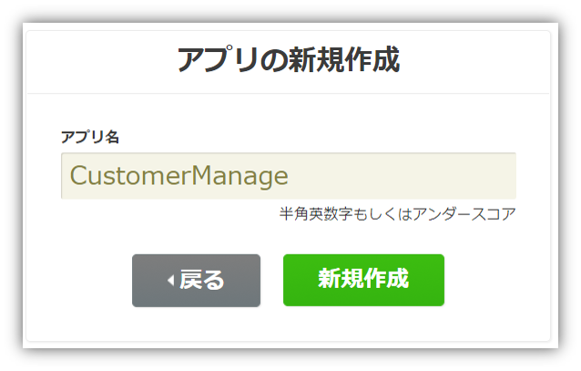  
  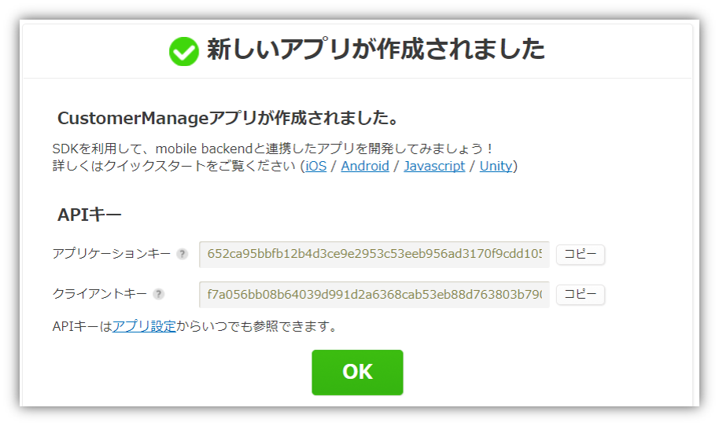  
  * 発行された API キー は後ほど使います（ここではOKで閉じる）
1. mobile backend に事前登録データとして「顧客（会社）」と「社員（担当者）」データ一式をインポートします
  * ダウンロードしたサンプルプロジェクトを解凍し、「Settings」フォルダ内「 `DEMO会社一覧_5件.json` 」と「 `DEMO社員一覧_10件.json` 」を次の手順でインポートします  
  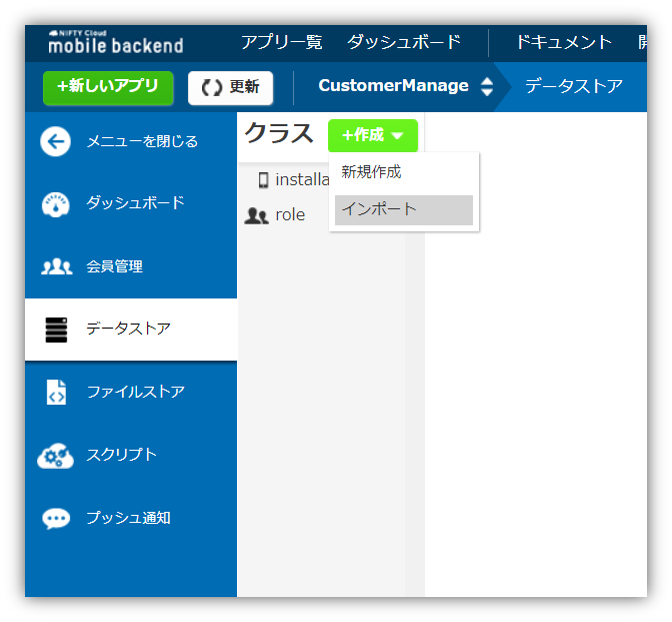  
  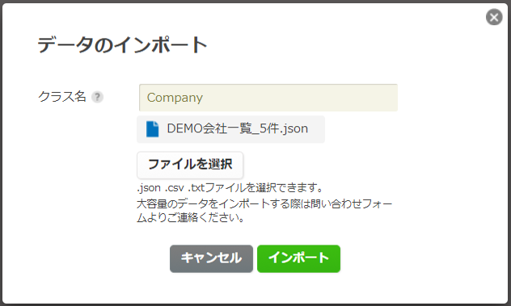  
  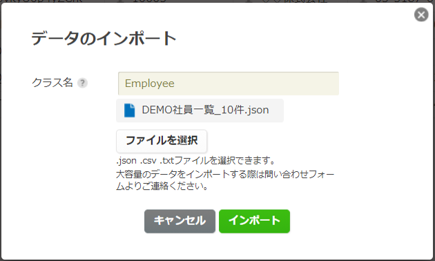  
  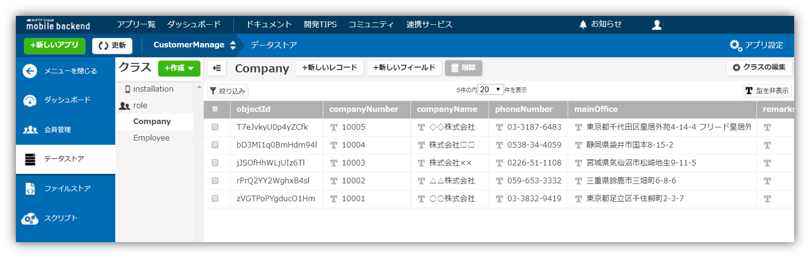  

1. Monaca にサンプルプロジェクトをインポートします
  * Monaca にログインします https://monaca.mobi/ja/login
  * ダウンロードしたサンプルプロジェクトを __zipファイル__ の状態（解凍前）で Monaca にインポートします
  * 「Import Project」をクリックします  
  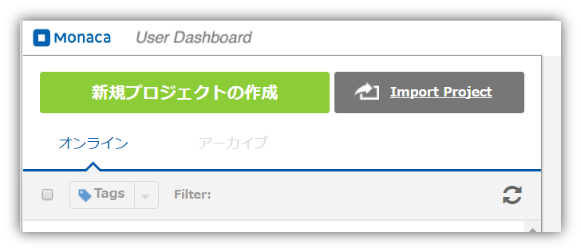  
  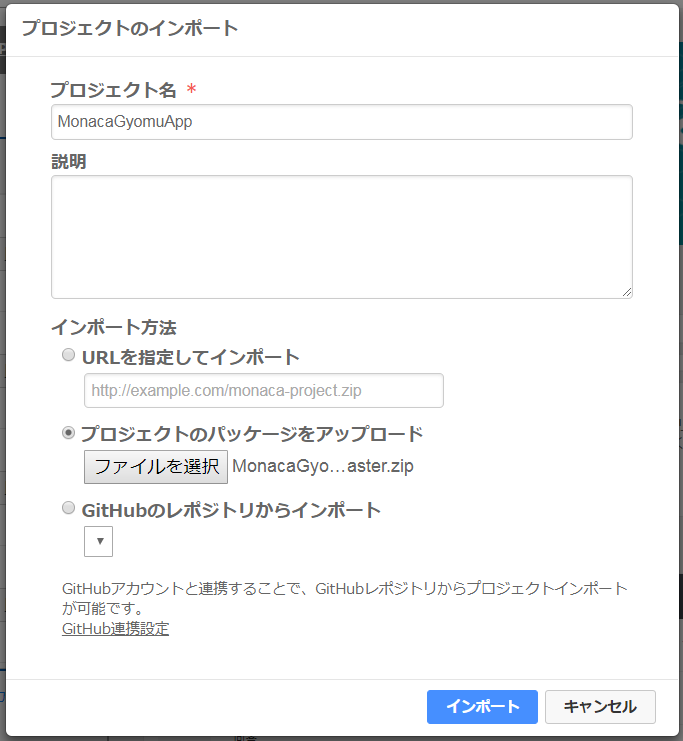  
  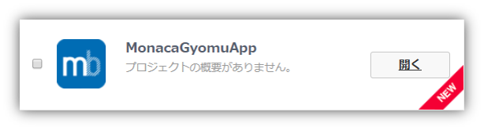  
1. プロジェクトを開き、次の設定をしておきます
  * `js/app.js` を開く
  * プレビュー画面を横向きにする  
  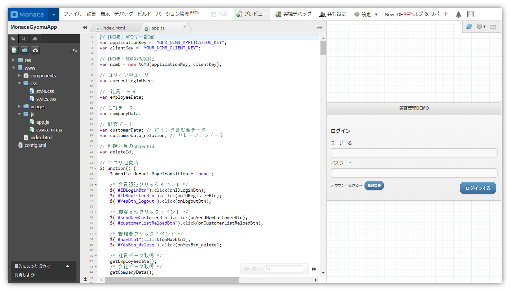  
1. mobile backend を利用するための JavaScript SDK を導入します
  * 「`設定`」＞「`JS/CSSコンポーネントの追加と削除...`」をクリックします  
  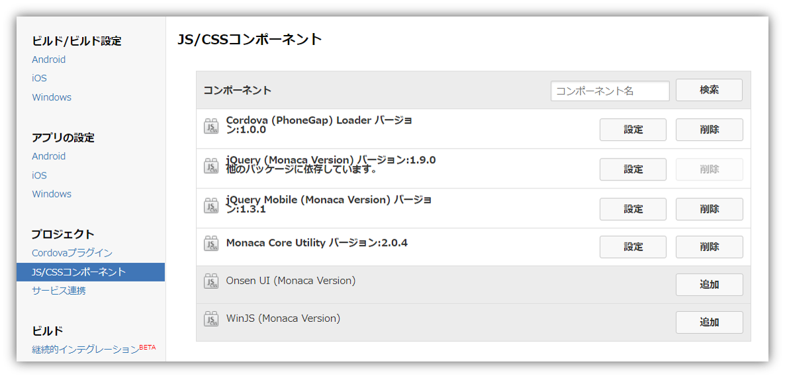  
  * 「コンポーネント名」に「`ncmb`」と入力して検索し、追加します  
  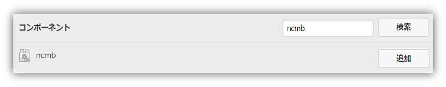  
  * 「バージョン」は最新（デフォルト）のままインストールします  
  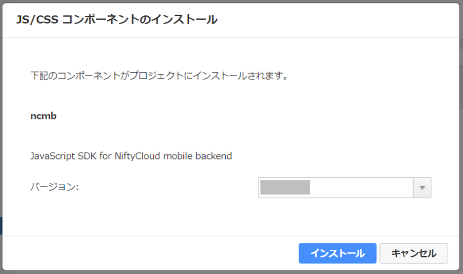  
  * 読み込むファイルにチェックを入れて保存します  
  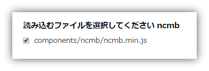  
  * 導入完了です  
  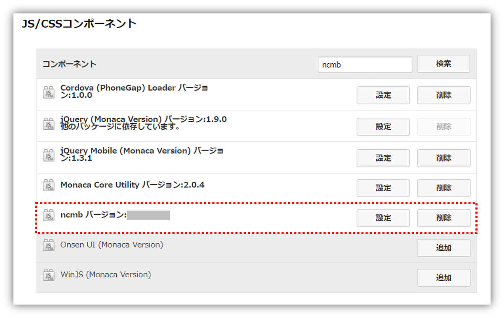  
1. 導入した SDK を初期化します
  * `js/app.js` を開きます
  * 2,3行目の `YOUR_NCMB_APPLICATION_KEY`, `YOUR_NCMB_CLIENT_KEY` を mobile backend で発行された APIキー に書き換えます  
  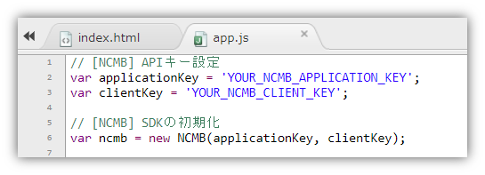  
  * APIキー の確認方法は以下です  
  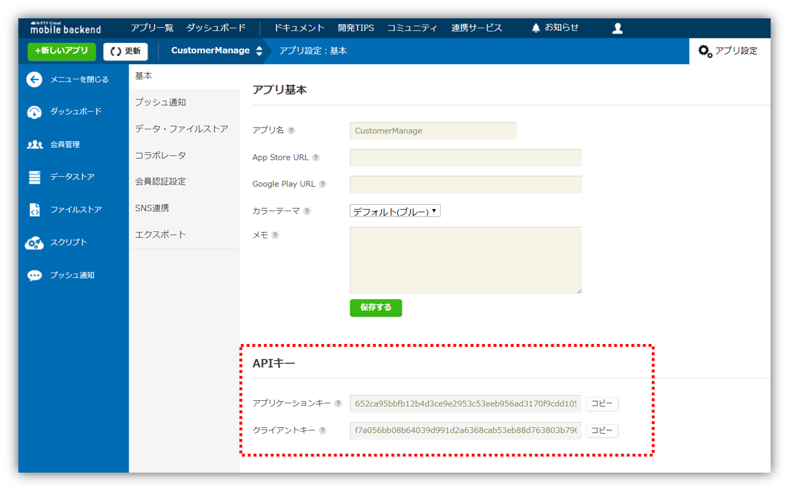  
  * APIキー は確実にすべてコピーして貼り付けてください
  * 正しくコピーできていない場合は動作ができません
  * 「コピー」ボタンの利用をお勧めします
  * 書き換える際は シングルクォーテーション （`'`）は消さないように注意してください

以上で準備は完了です

### 動作確認手順
大きく以下の４つに分けて説明します

1. 会員管理機能（新規登録・ログイン・ログアウト）
2. 事前登録データ（顧客(会社)・社員データ）の閲覧
3. 新規顧客担当者情報登録
4. 管理者機能（顧客担当者情報削除）

#### 1. 会員管理機能（新規登録・ログイン・ログアウト）
割愛

#### 2. 事前登録データ（顧客(会社)・社員データ）の閲覧
mobile backend にインポートしたデータを確認できます

* 「会社一覧」を選択すると会社データを一覧で確認できます  
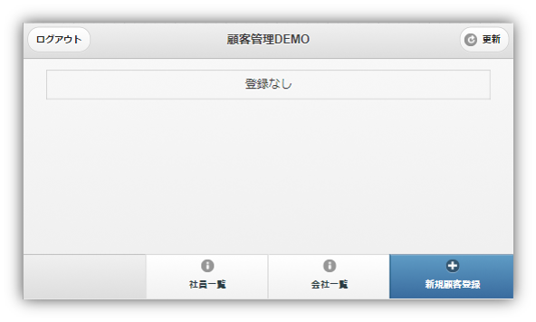  
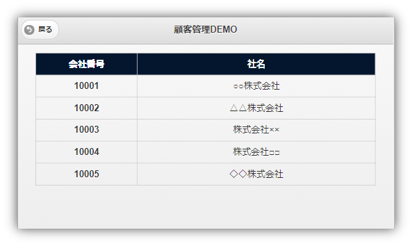  
* mobile backend から登録データを取得して表示しています
* 一覧から１つを選択すると詳細情報も確認できます  
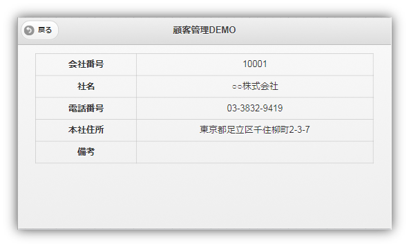  
* 「社員一覧」も同様です  
  
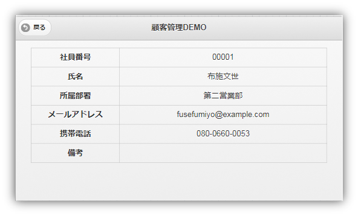  

#### 3. 新規顧客担当者情報登録
顧客（会社）と社員（担当者）を関連付けて登録することができます。登録したデータはトップページで一覧として確認できます。

* 「新規顧客登録」を選択すると登録ページに遷移します  
  
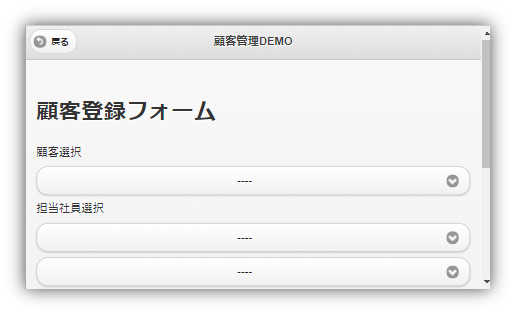  
* １つ目プルダウンから「顧客（会社）」を１つ選択します  
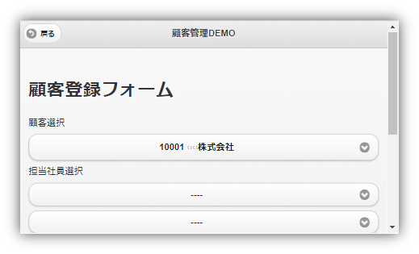  
* この顧客（会社）リストは、先ほど確認した「会社一覧」のデータと同じものです
* ２つ目以降のプルダウンから最初に選択した「顧客（会社）」の「担当者（社員）」を選択します  
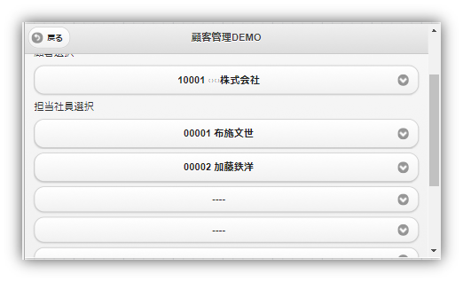  
  * 「担当者（社員）」に関しては１社につき複数の場合が考えられるため、５人まで選択可能にしています
* 任意で「備考」を記入して「登録する」ボタンを押します  
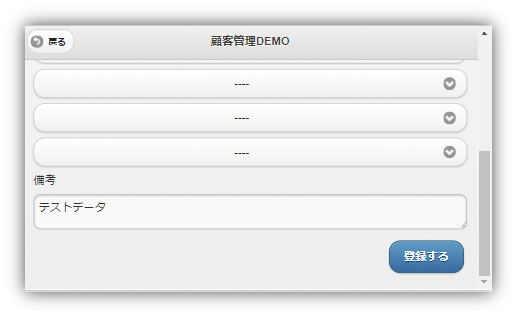  
* TOP 画面に遷移し、登録したデータのリストが表示されます  
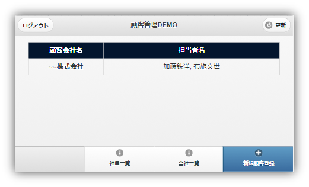  
* リストをタップすると、備考に記入した内容が alert で表示されます
* 次の操作のために一度「ログアウト」しておきましょう

#### 4. 管理者機能（顧客担当者情報削除）
* 管理者ユーザーを作成します
* 会員ロール「admin」を作成して、admin ロールに所属しているユーザーを管理者として、管理者機能（データの削除）を利用できるようにします
* mobile backend でロールを作成します  
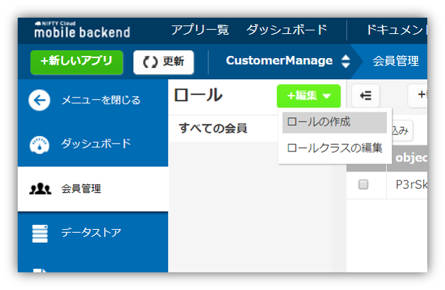  
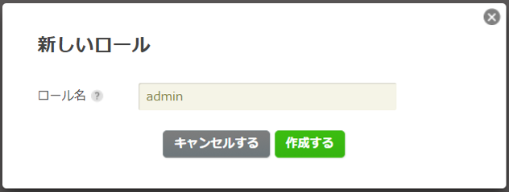  
* ロールができら、ロールにユーザーを登録します
* ロールに登録するユーザーの「objectId」をコピーします  
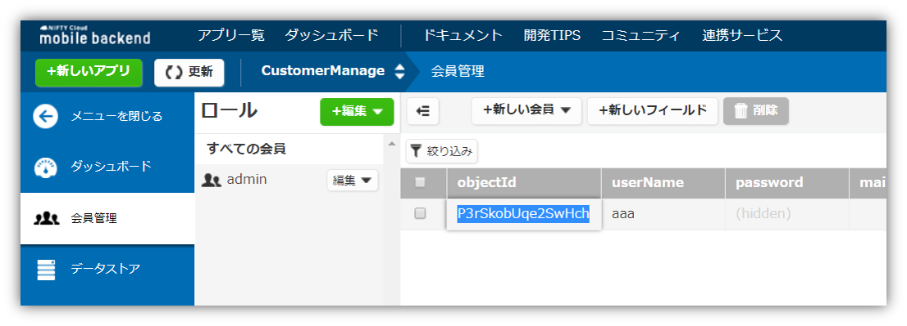  
* ロールにユーザーを登録します  
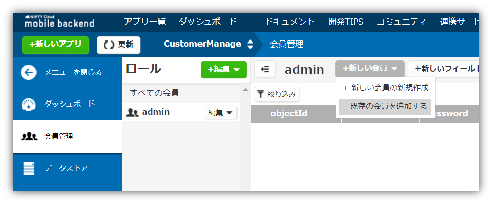  
* コピーした「objectId」を貼ります  
  
* 登録完了です  
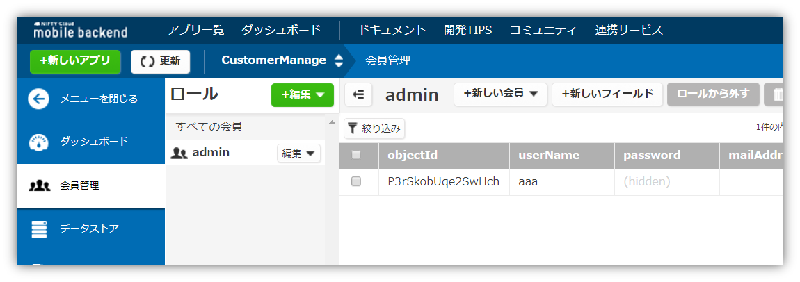  
* 管理者ユーザーでログインします
* ログイン後少しすると、管理者ボタンがフッターに表示されます  
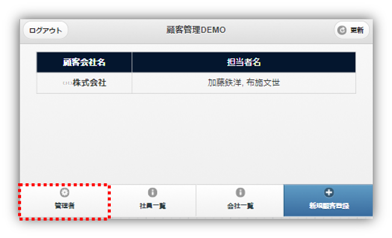  
* クリックします  
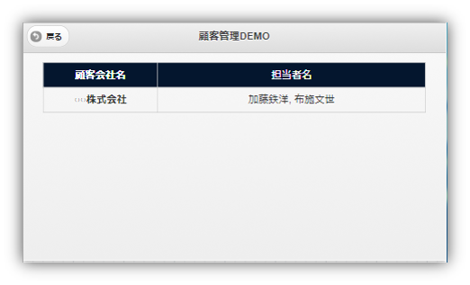  
* 削除したい登録データをクリックすると確認アラートが出ます
* 「はい」を選択します  
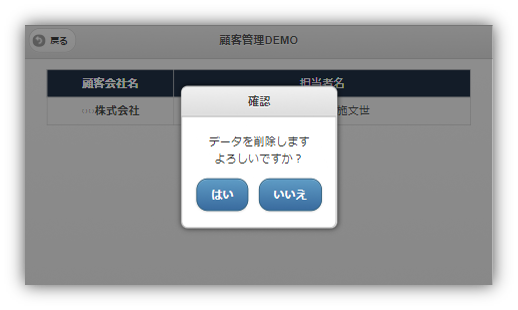  
* TOP 画面に遷移し、登録したデータのリストが更新されます  

